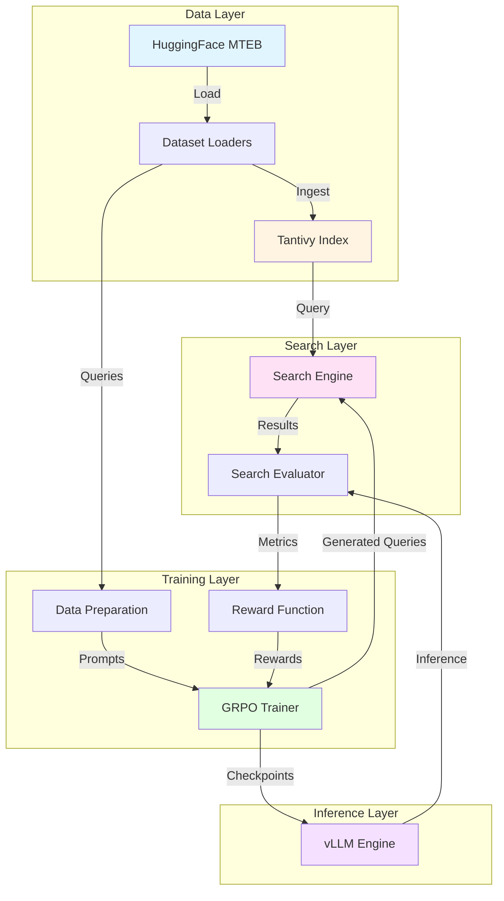
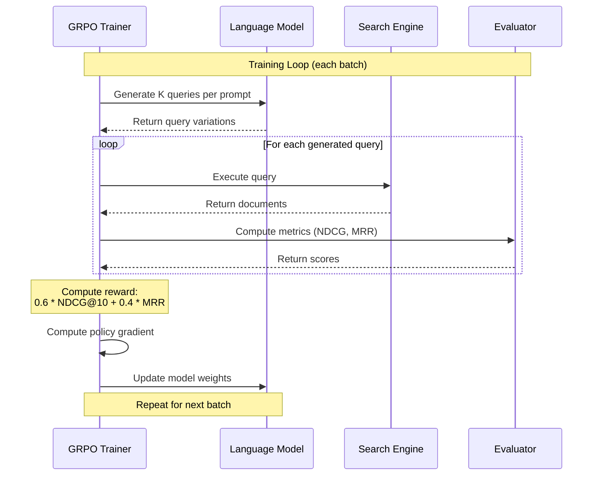
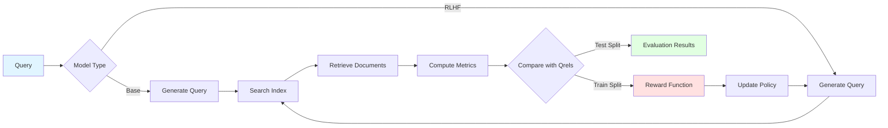

# SearchLM

A hackable codebase for training language models to generate better search queries using Reinforcement Learning with Verifiable Rewards (RLVR). SearchLM combines full-text search, evaluation metrics, and RLHF training to advance information retrieval research.

## Table of Contents

- [Overview](#overview)
- [Architecture](#architecture)
- [Key Features](#key-features)
- [Installation](#installation)
- [Quick Start](#quick-start)
- [Training Workflow](#training-workflow)
- [Usage Guide](#usage-guide)
- [Cloud Development](#cloud-development)
- [Configuration](#configuration)
- [Project Structure](#project-structure)
- [API Reference](#api-reference)
- [Evaluation Metrics](#evaluation-metrics)
- [Evaluation Results](#evaluation-results)
- [Contributing](#contributing)
- [License](#license)

## Overview

SearchLM addresses a challenge in information retrieval: generating effective search queries. Traditional approaches rely on manually crafted queries or simple reformulations, but SearchLM uses reinforcement learning with verifiable rewards from actual search results to train language models that generate superior queries.

### Core Components

SearchLM integrates four key subsystems:

1. **Data Pipeline**: Loads datasets (NFCorpus, SciFact) from HuggingFace MTEB and builds Tantivy search indices
2. **Search Engine**: Full-text search with boolean query support and dataset filtering
3. **Evaluation Framework**: Comprehensive IR metrics with statistical analysis across multiple evaluation runs
4. **RLHF Training**: Group Relative Policy Optimization (GRPO) with reward functions based on search quality

## Architecture

The system follows a modular design where each component has clear responsibilities and interfaces.



### Training Workflow

The RLHF training process uses GRPO to optimize query generation with verifiable rewards.



### Data Flow



## Key Features

### Dataset Management
- Automated loading of NFCorpus and SciFact from HuggingFace MTEB
- Train/dev/test splits with relevance judgments (qrels)
- Unified search index supporting multiple datasets

### Full-Text Search
- Tantivy-based search engine for high-performance indexing
- Boolean query support with field-specific search
- Dataset filtering and configurable result ranking

### Evaluation Framework
- Standard IR metrics: NDCG@K, MRR, Precision@K, Recall@K, MAP
- Multiple evaluation runs with aggregate statistics (mean, std, min, max)
- JSON audit logs for reproducibility
- Side-by-side comparison of base vs RLHF models

### RLHF Training
- Group Relative Policy Optimization (GRPO) algorithm
- Verifiable rewards based on actual search results
- Support for 1-GPU (colocate) and 2-GPU (server) modes
- Integration with Weights & Biases for experiment tracking

### Infrastructure
- vLLM integration for efficient inference
- Modal cloud platform for GPU development
- Hot reload mode for rapid iteration
- Persistent volume storage for datasets and checkpoints

## Installation

### Requirements

- Python 3.12
- CUDA 12.1+ (for GPU acceleration)
- Linux recommended (Ubuntu 22.04+)
- 16GB+ RAM for dataset processing
- 40GB+ GPU memory for training (H100 or A100 recommended)

### Install from Source

```bash
# Clone the repository
git clone https://github.com/SupreethRao99/searchLM.git
cd searchLM

# Install using uv (recommended for dependency management)
uv sync
```

### Alternative: Using pip

```bash
python3 -m venv venv
source venv/bin/activate
pip install -e .
```

### Environment Setup

```bash
# Copy environment template
cp .env.example .env

# Edit .env and add your tokens
# Required:
# - HF_TOKEN: HuggingFace token for dataset access
# Optional:
# - WANDB_API_KEY: Weights & Biases key for training monitoring
```

### Verify Installation

```python
# Test imports
from searchlm import load_dataset_split, SearchEngine, SearchEvaluator
print("SearchLM installed successfully!")
```

## Quick Start

### 1. Ingest Datasets

Build the search index from HuggingFace datasets:

```python
from searchlm import ingest_all_datasets

# Ingest both NFCorpus and SciFact datasets
# This downloads from HuggingFace and builds a Tantivy index
ingest_all_datasets(index_path="./modal_data/indices")
```

The ingestion process:
1. Downloads datasets from HuggingFace MTEB
2. Extracts documents and metadata
3. Builds a unified Tantivy index with dataset tags
4. Creates searchable fields for title and text

### 2. Load and Explore Datasets

```python
from searchlm import load_dataset_split

# Load test split of NFCorpus
nfcorpus_test = load_dataset_split("nfcorpus", split="test")
print(f"NFCorpus: {nfcorpus_test.num_queries} queries, {nfcorpus_test.num_documents} docs")

# Access queries and relevance judgments
for query_id, query_text in list(nfcorpus_test.queries.items())[:3]:
    print(f"Query: {query_text}")
    relevant_docs = nfcorpus_test.qrels[query_id]
    print(f"Relevant documents: {len(relevant_docs)}\n")

# Load SciFact
scifact_test = load_dataset_split("scifact", split="test")
print(f"SciFact: {scifact_test.num_queries} queries, {scifact_test.num_documents} docs")
```

### 3. Search the Index

```python
from searchlm import SearchEngine

# Initialize search engine
engine = SearchEngine(index_path="./modal_data/indices")

# Search across all datasets
results = engine.search("cancer treatment efficacy", limit=10)
for result in results[:3]:
    print(f"Score: {result['score']:.2f}")
    print(f"Title: {result['title']}")
    print(f"Dataset: {result['dataset']}\n")

# Search within specific dataset
nfcorpus_results = engine.search_by_dataset(
    "cancer treatment", 
    dataset="nfcorpus", 
    limit=10
)

# Boolean queries are supported
boolean_results = engine.search(
    'title:"breast cancer" AND text:treatment',
    limit=5
)
```

### 4. Evaluate Search Quality

```python
from searchlm import SearchEvaluator

# Initialize evaluator with the search index
evaluator = SearchEvaluator(index_path="./modal_data/indices")

# Evaluate a single query
metrics, error = evaluator.evaluate_single_query(
    query_text="cancer treatment efficacy",
    query_id="nfcorpus_1",
    dataset_name="nfcorpus",
    split="test",
    k=100
)

if not error:
    print(f"NDCG@10: {metrics['ndcg@10']:.4f}")
    print(f"MRR: {metrics['mrr']:.4f}")
    print(f"MAP: {metrics['map']:.4f}")
    print(f"Precision@10: {metrics['precision@10']:.4f}")
    print(f"Recall@100: {metrics['recall@100']:.4f}")

# Evaluate entire dataset (all queries in test split)
results = evaluator.evaluate(
    dataset_name="nfcorpus",
    split="test",
    k=100
)

# Print aggregate metrics
evaluator.print_metrics(results)
```

## Training Workflow

The complete training workflow consists of three stages: data preparation, training, and evaluation.

### Stage 1: Prepare Training Data

Generate prompts for each query in the training set:

```python
from searchlm.rlhf.data_prep import prepare_training_data

# Prepares prompts for all queries in train split
# Saves to modal_data/datasets/train
prepare_training_data()
```

This creates a HuggingFace dataset with columns:
- `prompt`: Formatted instruction for the LLM
- `query_id`: Original query identifier
- `dataset_name`: Source dataset (nfcorpus/scifact)

### Stage 2: RLHF Training

Train the model using GRPO with two deployment modes:

**Single GPU Mode (Recommended for H100):**

```python
from searchlm.rlhf.training import train

# Colocate mode: Training and inference on same GPU
# Memory efficient with gradient checkpointing
train(use_vllm_server=False)
```

**Dual GPU Mode (For multiple H100 GPUs):**

```python
# Server mode: vLLM on GPU 0, training on GPU 1
# Better throughput but requires 2 GPUs
train(use_vllm_server=True)
```

The training process:
1. Loads training dataset from Stage 1
2. Initializes GRPO trainer with reward function
3. For each batch:
   - Generates K query variations per prompt
   - Executes queries against search index
   - Computes NDCG@10 and MRR for each query
   - Calculates reward: 0.6 × NDCG@10 + 0.4 × MRR
   - Updates model with policy gradient
4. Saves checkpoints every N steps

Training hyperparameters (configurable in `config/default.yaml`):
- Learning rate: 1e-6
- Epochs: 3
- Batch size: 1 (colocate) or 8 (server)
- Gradient accumulation: 16 (colocate) or 4 (server)
- Effective batch size: 16 (both modes)

### Stage 3: Comprehensive Evaluation

Evaluate both base and RLHF models with statistical analysis:

```python
from searchlm.rlhf.evaluation import evaluate_multiple_runs

# Run multiple evaluations for robust statistics
evaluate_multiple_runs(
    base_model_name="Qwen/Qwen2.5-3B-Instruct",
    checkpoint_path=None,  # Uses latest checkpoint automatically
    num_runs=3,  # Number of evaluation runs per model
    evaluate_base=True,  # Evaluate base model
    evaluate_rlhf=True,  # Evaluate RLHF model
)
```

This generates:
- Individual JSON files per run: `base_eval_run1.json`, `rlhf_eval_run1.json`, etc.
- Aggregate statistics: `evaluation_summary.json` with mean/std/min/max across runs
- Side-by-side comparison of base vs RLHF performance

Example output structure:

```json
{
  "base_model": {
    "ndcg@10": {"mean": 0.3245, "std": 0.0012, "min": 0.3233, "max": 0.3257},
    "mrr": {"mean": 0.4123, "std": 0.0018, "min": 0.4105, "max": 0.4141}
  },
  "rlhf_model": {
    "ndcg@10": {"mean": 0.3789, "std": 0.0015, "min": 0.3774, "max": 0.3804},
    "mrr": {"mean": 0.4567, "std": 0.0021, "min": 0.4546, "max": 0.4588}
  }
}
```

## Usage Guide

### Dataset Operations

**Loading Datasets:**

```python
from searchlm import load_dataset_split

# Load specific split
train_data = load_dataset_split("nfcorpus", split="train")
dev_data = load_dataset_split("scifact", split="dev")
test_data = load_dataset_split("nfcorpus", split="test")

# Access dataset components
print(f"Queries: {len(train_data.queries)}")
print(f"Documents: {len(train_data.documents)}")
print(f"Qrels: {len(train_data.qrels)}")

# Iterate over queries
for query_id, query_text in train_data.queries.items():
    # Get relevance judgments for this query
    relevant_docs = train_data.qrels.get(query_id, {})
    # relevant_docs is a dict: {doc_id: relevance_score}
```

**Ingesting Custom Datasets:**

```python
from searchlm.data.ingesters import BaseIngester
from searchlm.data.schemas import IndexSchema
import tantivy

# Create custom ingester
class MyIngester(BaseIngester):
    def ingest(self, writer: tantivy.IndexWriter):
        for doc in self.load_documents():
            writer.add_document(tantivy.Document(
                doc_id=doc["id"],
                title=doc["title"],
                text=doc["text"],
                dataset="my_dataset",
                source_id=doc["source_id"]
            ))

# Use the ingester
schema = IndexSchema().build()
index = tantivy.Index(schema, path="./my_index")
writer = index.writer()
ingester = MyIngester(writer)
ingester.ingest(writer)
writer.commit()
```

### Search Operations

**Basic Search:**

```python
from searchlm import SearchEngine

engine = SearchEngine(index_path="./modal_data/indices")

# Simple keyword search
results = engine.search("machine learning", limit=20)

# Iterate over results
for result in results:
    print(f"Document: {result['doc_id']}")
    print(f"Score: {result['score']:.2f}")
    print(f"Title: {result['title']}")
    print(f"Dataset: {result['dataset']}")
    print()
```

**Advanced Query Syntax:**

```python
# Boolean operators
results = engine.search("cancer AND treatment", limit=10)
results = engine.search("cancer OR tumor", limit=10)
results = engine.search("cancer NOT chemotherapy", limit=10)

# Field-specific search
results = engine.search('title:cancer', limit=10)
results = engine.search('text:"machine learning"', limit=10)

# Combined queries
results = engine.search(
    'title:cancer AND text:(treatment OR therapy)',
    limit=10
)

# Dataset filtering
nfcorpus_only = engine.search(
    "cancer treatment",
    dataset_filter="nfcorpus",
    limit=10
)
```

**Custom Search Fields:**

```python
# Search only in titles
results = engine.search(
    "cancer",
    fields=["title"],
    limit=10
)

# Search in both title and text (default)
results = engine.search(
    "cancer",
    fields=["title", "text"],
    limit=10
)
```

### Evaluation Operations

**Single Query Evaluation:**

```python
from searchlm import SearchEvaluator

evaluator = SearchEvaluator(index_path="./modal_data/indices")

# Evaluate with query text
metrics, error = evaluator.evaluate_single_query(
    query_text="cancer treatment efficacy",
    query_id="nfcorpus_1",
    dataset_name="nfcorpus",
    split="test",
    k=100  # Retrieve top 100 documents
)

if error:
    print(f"Error: {error}")
else:
    # Access individual metrics
    print(f"NDCG@10: {metrics['ndcg@10']:.4f}")
    print(f"NDCG@100: {metrics['ndcg@100']:.4f}")
    print(f"MRR: {metrics['mrr']:.4f}")
    print(f"MAP: {metrics['map']:.4f}")
    print(f"Precision@5: {metrics['precision@5']:.4f}")
    print(f"Recall@100: {metrics['recall@100']:.4f}")
```

**Dataset Evaluation:**

```python
# Evaluate all queries in a dataset split
results = evaluator.evaluate(
    dataset_name="nfcorpus",
    split="test",
    k=100
)

# Results contain aggregate metrics and per-query details
print(f"Average NDCG@10: {results.avg_ndcg_10:.4f}")
print(f"Average MRR: {results.avg_mrr:.4f}")
print(f"Queries evaluated: {len(results.query_results)}")

# Access per-query results
for query_result in results.query_results[:5]:
    print(f"Query: {query_result.query_id}")
    print(f"  NDCG@10: {query_result.ndcg_10:.4f}")
    print(f"  Error: {query_result.error}")
```

**Custom Evaluation:**

```python
# Provide your own qrels (relevance judgments)
qrels = {
    "doc_1": 2,  # Highly relevant
    "doc_2": 1,  # Somewhat relevant
    "doc_3": 0,  # Not relevant
}

metrics, error = evaluator.evaluate_query(
    query_text="my custom query",
    qrels=qrels,
    k=100,
    dataset_filter="nfcorpus"
)
```

### Configuration Management

**Loading Configuration:**

```python
from searchlm.config import get_config, load_config

# Get default config
config = get_config()

# Access nested values
model_name = config.model.name
learning_rate = config.training.learning_rate
ndcg_weight = config.reward.ndcg_weight

# Load custom config file
config = load_config("path/to/custom/config.yaml")
```

**Path Management:**

```python
from searchlm.config import get_data_path

# Get paths for different data types
datasets_dir = get_data_path("datasets")
models_dir = get_data_path("models")
indices_dir = get_data_path("indices")
outputs_dir = get_data_path("outputs")

# Works both locally and on Modal
# Local: resolves relative to project root
# Modal: resolves to /root/searchlm/modal_data/
```

**Runtime Configuration Overrides:**

```python
from searchlm.config import merge_config

# Override specific values at runtime
config = merge_config({
    "training": {
        "learning_rate": 5e-7,
        "num_epochs": 5
    },
    "reward": {
        "ndcg_weight": 0.7,
        "mrr_weight": 0.3
    }
})
```

## Cloud Development

SearchLM provides seamless cloud GPU development through Modal, enabling rapid iteration without local GPU requirements.

### Modal Setup

```bash
# Install Modal CLI
uv add modal

# Authenticate
modal token new

# Verify setup
modal app list
```

### Development

**Interactive Shell Mode:**

For debugging and exploration:

```bash
# Terminal 1: Start persistent container
modal run modal_infra.py::dev_shell

# Terminal 2: Get container ID and connect
modal container list
# Copy the container ID (e.g., ta-XXXXXXXXXXXXXXXXXXXXX)

modal shell ta-XXXXXXXXXXXXXXXXXXXXX

# Now you're inside the GPU container
cd /root/searchlm
python -m searchlm.rlhf.data_prep
python -m searchlm.rlhf.training
# ... explore and debug interactively
```

### Volume Management

Modal uses persistent volumes for data storage:

```bash
# List volumes
modal volume ls

# Browse volume contents
modal volume ls searchlm

# Browse specific directory
modal volume ls searchlm modal_data/models

# Download files from volume
modal volume get searchlm modal_data/models/final ./local_models/

# Upload files to volume
modal volume put searchlm ./local_data/ modal_data/datasets/
```

### Resource Configuration

Edit `modal_infra.py` to customize GPU and compute resources:

```python
@app.function(
    image=searchlm_image,
    gpu="H100",  # Options: L4, A10G, A100, H100
    timeout=7200,  # Max runtime in seconds
    memory=32768,  # Memory in MB
    volumes={
        CONTAINER_DATA_PATH: volume,
        "/root/.cache/huggingface": hf_cache_vol,
    },
)
def my_workflow():
    # Your code here
    pass
```

## Configuration

Configuration is managed through `config/default.yaml`. All settings are hierarchical and type-safe via OmegaConf.

### Model Configuration

```yaml
model:
  name: "Qwen/Qwen2.5-3B-Instruct"
  max_tokens: 1024
  temperature: 0.7
  max_model_len: 4096
```

### Training Hyperparameters

```yaml
training:
  learning_rate: 1e-6
  num_epochs: 3
  
  # Separate configs for 1-GPU vs 2-GPU modes
  batch_size:
    colocate: 1  # Single GPU mode
    server: 8    # Dual GPU mode
  
  gradient_accumulation_steps:
    colocate: 16  # Effective batch size = 1 * 16 = 16
    server: 4     # Effective batch size = 8 * 4 = 32
  
  max_new_tokens: 2048
  num_generations: 2  # K query variations per prompt
  gradient_checkpointing: true
  precision: "bf16"
  
  # Checkpointing
  logging_steps: 10
  save_steps: 50
  save_total_limit: 3
  
  # vLLM settings for colocate mode
  vllm_gpu_memory_utilization: 0.25
  
  # Weights & Biases
  wandb_run_name:
    colocate: "searchlm-grpo-qwen2.5-3b"
    server: "searchlm-grpo-qwen2.5-3b-server"
```

### Reward Function

```yaml
reward:
  ndcg_weight: 0.6  # Weight for NDCG@10
  mrr_weight: 0.4   # Weight for MRR
  split: "train"    # Dataset split for training
  eval_k: 100       # Number of documents to retrieve
```

### Evaluation Settings

```yaml
evaluation:
  temperature: 0.7
  max_tokens: 1024
  default_k: 100
  datasets: ["scifact", "nfcorpus"]
```

### Path Configuration

```yaml
paths:
  data_dir: "./modal_data"
  
  subdirs:
    datasets: "datasets"
    outputs: "outputs"
    models: "models"
    indices: "indices"
```

## Project Structure

```
searchlm/
├── searchlm/                    # Main package
│   ├── __init__.py              # Public API exports
│   ├── config.py                # Configuration management
│   ├── prompts.py               # LLM prompts and utilities
│   ├── inference.py             # vLLM inference engine
│   │
│   ├── data/                    # Data loading and ingestion
│   │   ├── loaders/             # Dataset loaders
│   │   │   ├── base.py          # Base loader interface
│   │   │   ├── nfcorpus.py      # NFCorpus implementation
│   │   │   ├── scifact.py       # SciFact implementation
│   │   │   ├── factory.py       # Loader factory
│   │   │   └── helpers.py       # Shared utilities
│   │   ├── ingesters/           # Search index ingestion
│   │   │   ├── base.py          # Base ingester
│   │   │   ├── nfcorpus.py      # NFCorpus ingester
│   │   │   ├── scifact.py       # SciFact ingester
│   │   │   └── pipeline.py      # Ingestion pipeline
│   │   └── schemas/             # Index schema definitions
│   │       ├── constants.py     # Field name constants
│   │       └── index.py         # Tantivy schema builder
│   │
│   ├── services/                # Core services
│   │   ├── search.py            # Search engine (Tantivy wrapper)
│   │   ├── evaluator.py         # Evaluation orchestration
│   │   └── metrics.py           # IR metrics computation
│   │
│   ├── models/                  # Domain models
│   │   ├── domain.py            # Core data models
│   │   └── evaluation.py        # Evaluation result models
│   │
│   └── rlhf/                    # RLHF training workflows
│       ├── data_prep.py         # Training data preparation
│       ├── reward.py            # Reward function implementation
│       ├── training.py          # GRPO training loop
│       └── evaluation.py        # Multi-run evaluation
│
├── config/
│   └── default.yaml             # Default configuration
│
├── scripts/
│   ├── __init__.py
│   └── upload_to_hf.py          # HuggingFace Hub upload utility
│
├── modal_infra.py               # Modal infrastructure definition
├── pyproject.toml               # Package dependencies
├── uv.lock                      # Locked dependencies
├── Makefile                     # Development commands
├── README.md                    # This file
└── LICENSE                      # MIT License
```

### Key Design Principles

**Clear Boundaries**: Each package has a single responsibility:
- `data/`: Loading and ingestion
- `services/`: Search and evaluation
- `models/`: Data structures
- `rlhf/`: Training workflows

**Minimal Abstraction**: Code is straightforward and modifiable without deep framework knowledge. No complex inheritance hierarchies or magical metaprogramming.

**Shared Utilities**: Common patterns are extracted into helpers to reduce duplication while keeping code readable.

## API Reference

### Dataset Loading

**`load_dataset_split(dataset_name: str, split: str) -> DatasetSplit`**

Load a dataset split with queries, documents, and relevance judgments.

```python
from searchlm import load_dataset_split

data = load_dataset_split("nfcorpus", split="test")

# Attributes
data.queries          # Dict[str, str]: query_id -> query_text
data.documents        # Dict[str, Dict]: doc_id -> {title, text, ...}
data.qrels            # Dict[str, Dict[str, int]]: query_id -> {doc_id: relevance}
data.num_queries      # int
data.num_documents    # int
```

**`ingest_all_datasets(index_path: str) -> None`**

Ingest all supported datasets into a search index.

```python
from searchlm import ingest_all_datasets

ingest_all_datasets(index_path="./modal_data/indices")
```

### Search Engine

**`SearchEngine(index_path: str)`**

Initialize a search engine with an existing index.

```python
from searchlm import SearchEngine

engine = SearchEngine(index_path="./modal_data/indices")
```

**`search(query: str, limit: int = 10, fields: Optional[List[str]] = None, dataset_filter: Optional[str] = None) -> List[Dict[str, Any]]`**

Execute a search query.

```python
results = engine.search(
    query="cancer treatment",
    limit=20,
    fields=["title", "text"],
    dataset_filter="nfcorpus"
)

# Each result contains:
# {
#   "score": float,
#   "doc_id": str,
#   "title": str,
#   "text": str,
#   "dataset": str,
#   "source_id": str
# }
```

**`search_by_dataset(query: str, dataset: str, limit: int = 10) -> List[Dict[str, Any]]`**

Search within a specific dataset.

```python
results = engine.search_by_dataset("cancer", dataset="nfcorpus", limit=10)
```

### Search Evaluator

**`SearchEvaluator(index_path: str)`**

Initialize an evaluator with a search index.

```python
from searchlm import SearchEvaluator

evaluator = SearchEvaluator(index_path="./modal_data/indices")
```

**`evaluate_single_query(query_text: str, query_id: str, dataset_name: str, split: str, k: int) -> Tuple[Dict[str, float], Optional[str]]`**

Evaluate a single query against ground truth.

```python
metrics, error = evaluator.evaluate_single_query(
    query_text="cancer treatment",
    query_id="nfcorpus_1",
    dataset_name="nfcorpus",
    split="test",
    k=100
)

# Returns tuple: (metrics_dict, error_message)
# metrics_dict contains: ndcg@10, ndcg@100, mrr, map, precision@k, recall@k
```

**`evaluate(dataset_name: str, split: str, k: int) -> EvaluationResult`**

Evaluate all queries in a dataset split.

```python
results = evaluator.evaluate(
    dataset_name="nfcorpus",
    split="test",
    k=100
)

# Returns EvaluationResult with:
results.avg_ndcg_10      # Average NDCG@10
results.avg_mrr          # Average MRR
results.query_results    # List of per-query results
```

**`evaluate_query(query_text: str, qrels: Dict[str, int], k: int, dataset_filter: Optional[str] = None) -> Tuple[Dict[str, float], Optional[str]]`**

Evaluate with custom relevance judgments.

```python
qrels = {"doc_1": 2, "doc_2": 1}
metrics, error = evaluator.evaluate_query(
    query_text="my query",
    qrels=qrels,
    k=100,
    dataset_filter="nfcorpus"
)
```

### Configuration

**`get_config() -> DictConfig`**

Get the current configuration.

```python
from searchlm.config import get_config

config = get_config()
model_name = config.model.name
learning_rate = config.training.learning_rate
```

**`load_config(config_path: Optional[str] = None) -> DictConfig`**

Load configuration from file.

```python
from searchlm.config import load_config

config = load_config("path/to/config.yaml")
```

**`get_data_path(subdir: str) -> Path`**

Get path for data subdirectory.

```python
from searchlm.config import get_data_path

datasets_dir = get_data_path("datasets")
models_dir = get_data_path("models")
indices_dir = get_data_path("indices")
outputs_dir = get_data_path("outputs")
```

## Evaluation Metrics

SearchLM implements standard information retrieval metrics following TREC conventions.

### NDCG@K (Normalized Discounted Cumulative Gain)

Measures ranking quality with position-aware discounting. Accounts for graded relevance.

**Formula:**
```
DCG@k = Σ(i=1 to k) [rel(i) / log₂(i+1)]
NDCG@k = DCG@k / IDCG@k
```

**Range:** [0, 1], where 1 is perfect ranking

**Interpretation:**
- 0.8-1.0: Excellent ranking
- 0.6-0.8: Good ranking
- 0.4-0.6: Fair ranking
- 0.0-0.4: Poor ranking

### MRR (Mean Reciprocal Rank)

Measures how quickly the first relevant document appears.

**Formula:**
```
RR = 1 / rank_of_first_relevant_doc
MRR = average(RR) across all queries
```

**Range:** [0, 1], where 1 means first result is always relevant

### MAP (Mean Average Precision)

Measures precision across all relevant documents.

**Formula:**
```
AP = (1/R) × Σ(k=1 to N) [P(k) × rel(k)]
where R = total relevant docs
```

**Range:** [0, 1], considers both precision and recall

### Precision@K

Fraction of retrieved documents that are relevant.

**Formula:**
```
Precision@k = (relevant docs in top k) / k
```

**Range:** [0, 1]

### Recall@K

Fraction of relevant documents that are retrieved.

**Formula:**
```
Recall@k = (relevant docs in top k) / (total relevant docs)
```

**Range:** [0, 1]

### Usage in SearchLM

```python
# All metrics computed automatically
metrics, error = evaluator.evaluate_single_query(
    query_text="query",
    query_id="id",
    dataset_name="nfcorpus",
    split="test",
    k=100
)

# Available metrics
metrics["ndcg@10"]      # NDCG at position 10
metrics["ndcg@100"]     # NDCG at position 100
metrics["mrr"]          # Mean Reciprocal Rank
metrics["map"]          # Mean Average Precision
metrics["precision@5"]  # Precision at 5
metrics["precision@10"] # Precision at 10
metrics["recall@10"]    # Recall at 10
metrics["recall@100"]   # Recall at 100
```

## Evaluation Results

Performance comparison between the base model and RLHF-trained model across SciFact and NFCorpus datasets. Results show mean ± standard deviation across 3 evaluation runs.

### SciFact Dataset

| Model | NDCG@10 | NDCG@100 | MRR | MAP | Precision@10 | Recall@10 |
|-------|---------|----------|-----|-----|--------------|-----------|
| **Base** (Qwen2.5-3B-Instruct) | 0.1644 ± 0.0204 | 0.1718 ± 0.0156 | 0.1523 ± 0.0183 | 0.1502 ± 0.0162 | 0.0413 ± 0.0069 | 0.2016 ± 0.0279 |
| **RLHF** (final checkpoint) | **0.6512 ± 0.0040** | **0.6696 ± 0.0032** | **0.6092 ± 0.0045** | **0.6009 ± 0.0041** | **0.0870 ± 0.0005** | **0.7839 ± 0.0025** |
| **Improvement** | +296.0% | +289.7% | +300.1% | +300.1% | +110.6% | +288.8% |

### NFCorpus Dataset

| Model | NDCG@10 | NDCG@100 | MRR | MAP | Precision@10 | Recall@10 |
|-------|---------|----------|-----|-----|--------------|-----------|
| **Base** (Qwen2.5-3B-Instruct) | 0.3345 ± 0.0076 | 0.3355 ± 0.0080 | 0.3197 ± 0.0081 | 0.2834 ± 0.0035 | 0.2093 ± 0.0102 | 0.0853 ± 0.0008 |
| **RLHF** (final checkpoint) | **0.5502 ± 0.0031** | **0.5448 ± 0.0017** | **0.5338 ± 0.0050** | **0.4114 ± 0.0021** | **0.2982 ± 0.0024** | **0.1577 ± 0.0003** |
| **Improvement** | +64.5% | +62.4% | +66.9% | +45.2% | +42.5% | +84.9% |

### Key Observations

**Significant RLHF Improvements:**
- **SciFact**: The RLHF model shows dramatic improvements across all metrics, with ~300% gains in NDCG, MRR, and MAP. This indicates the model learned to generate highly effective queries for scientific fact retrieval.
- **NFCorpus**: The RLHF model achieves 60-85% improvements in retrieval metrics, demonstrating strong performance gains on medical literature search.

**Consistency Across Runs:**
- RLHF model shows low standard deviations (< 0.5% for most metrics), indicating stable and reliable performance
- Base model has higher variance, especially on SciFact (std ~2% for NDCG@10)

**Recall Performance:**
- RLHF model retrieves 78.4% of relevant documents in top-10 for SciFact (vs 20.2% for base)
- For NFCorpus, recall@10 nearly doubles from 8.5% to 15.8%

**Training Configuration:**
- Base Model: `Qwen/Qwen2.5-3B-Instruct`
- Training: Group Relative Policy Optimization (GRPO)
- Reward Function: 0.6 × NDCG@10 + 0.4 × MRR
- Training Data: 3 epochs on train splits (NFCorpus + SciFact)
- Hardware: Single H100 GPU
- Checkpoint: `checkpoint-1146`

## Model Sharing

### Upload to HuggingFace Hub

After training, share your model on HuggingFace Hub:

```bash
# Upload latest checkpoint (private by default)
python scripts/upload_to_hf.py --repo-name searchlm-qwen2.5-3b-rlhf

# Upload specific checkpoint
python scripts/upload_to_hf.py \
  --repo-name searchlm-qwen2.5-3b-rlhf \
  --checkpoint-path ./modal_data/models/checkpoint-500

# Upload as public repository
python scripts/upload_to_hf.py \
  --repo-name searchlm-qwen2.5-3b-rlhf \
  --public
```

The script automatically:
- Finds the latest checkpoint if not specified
- Generates a comprehensive model card with:
  - Training configuration
  - Evaluation results
  - Usage examples
  - Citation information
- Uploads all model files
- Creates a private repository (use `--public` to make it public)

### Using Shared Models

```python
from transformers import AutoModelForCausalLM, AutoTokenizer

# Load from HuggingFace Hub
model = AutoModelForCausalLM.from_pretrained("Supreeth/searchlm-qwen2.5-3b-rlhf")
tokenizer = AutoTokenizer.from_pretrained("Supreeth/searchlm-qwen2.5-3b-rlhf")

# Use for inference
from searchlm import generate_query

query = generate_query(
    model=model,
    tokenizer=tokenizer,
    query_text="What are the effects of vitamin D?",
    search_domain="medical research"
)
```

## Contributing

Contributions are welcome! SearchLM is designed to be hackable and extensible.

### Development Setup

```bash
# Clone and install with dev dependencies
git clone https://github.com/SupreethRao99/searchLM.git
cd searchLM
uv sync
```

### Adding New Datasets

1. Create a loader in `searchlm/data/loaders/`:

```python
from searchlm.data.loaders.base import BaseDatasetLoader

class MyDatasetLoader(BaseDatasetLoader):
    def load_split(self, split: str) -> DatasetSplit:
        # Load from your source
        # Return DatasetSplit with queries, documents, qrels
        pass
```

2. Create an ingester in `searchlm/data/ingesters/`:

```python
from searchlm.data.ingesters.base import BaseIngester

class MyDatasetIngester(BaseIngester):
    def ingest(self, writer):
        # Load and index documents
        pass
```

3. Register in the factory:

```python
# In searchlm/data/loaders/factory.py
DATASET_LOADERS = {
    "nfcorpus": NFCorpusLoader,
    "scifact": SciFactLoader,
    "my_dataset": MyDatasetLoader,  # Add here
}
```

### Code Style

- Use type hints for all function signatures
- Follow PEP 8 naming conventions
- Keep functions focused and under 50 lines when possible
- Add docstrings for public APIs
- Write tests for new functionality

## Supported Datasets

### NFCorpus

A full-text retrieval dataset for the medical domain.

**Statistics:**
- Train: 2,590 queries
- Dev: 323 queries
- Test: 323 queries
- Documents: 3,633 medical articles

**Source:** MTEB (Massive Text Embedding Benchmark)

### SciFact

A scientific fact-checking dataset for evaluating retrieval over scientific claims.

**Statistics:**
- Train: 809 queries
- Dev: 300 queries  
- Test: 300 queries
- Documents: 5,183 scientific papers

**Source:** MTEB (Massive Text Embedding Benchmark)

Both datasets include:
- Natural language queries
- Document corpus
- Relevance judgments (qrels) with graded relevance scores
- Train/dev/test splits for proper evaluation

## License

MIT License - see [LICENSE](LICENSE) file for details.

## Citation

If you use SearchLM in your research, please cite:

```bibtex
@software{searchlm2026,
  author = {Rao, Supreeth},
  title = {SearchLM: Training Language Models for Search with Verifiable Rewards},
  year = {2026},
  url = {https://github.com/SupreethRao99/searchLM}
}
```

## Contact
For bugs and feature requests, please open an issue on GitHub.

## Acknowledgments

SearchLM builds on excellent open-source projects:
- [Tantivy](https://github.com/quickwit-oss/tantivy) - Fast full-text search engine
- [vLLM](https://github.com/vllm-project/vllm) - Efficient LLM inference
- [TRL](https://github.com/huggingface/trl) - Transformer Reinforcement Learning
- [Modal](https://modal.com/) - Cloud compute platform
- [MTEB](https://github.com/embeddings-benchmark/mteb) - Massive Text Embedding Benchmark
