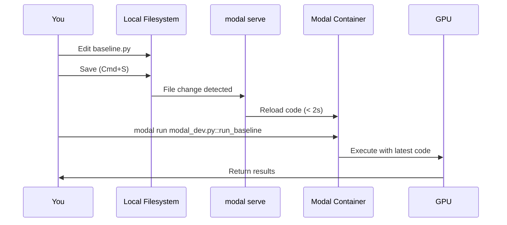

# Modal Development Guide

Complete guide for developing SearchLM with Modal's cloud GPU infrastructure. This guide covers two powerful development workflows: **Hot Reload Mode** for rapid iteration and **Interactive Shell Mode** for deep debugging.

## Table of Contents

- [Overview](#overview)
- [Quick Start](#quick-start)
- [Hot Reload Workflow](#hot-reload-workflow)
- [Interactive Shell Workflow](#interactive-shell-workflow)
- [Comparison & Decision Guide](#comparison--decision-guide)
- [Testing Your Setup](#testing-your-setup)
- [Troubleshooting](#troubleshooting)
- [Quick Reference](#quick-reference)

---

## Overview

SearchLM provides Modal infrastructure for cloud-based GPU development with two complementary workflows:

### 🔥 Hot Reload Mode (Recommended for Iteration)

Edit code locally and changes automatically sync to the remote GPU container in 2-3 seconds. Perfect for rapid iteration on workflows.

**Iteration speed:** Edit → Save → Run (2-3 seconds)

### 🐚 Interactive Shell Mode (For Deep Debugging)

Get VM-like SSH access to a running container with full GPU access. Perfect for exploration, debugging, and manual testing.

**Best for:** Interactive exploration, step-through debugging, ad-hoc commands

### Choose Your Workflow

```
Is your task repetitive iteration on a known script?
  ├─ Yes → Hot Reload Mode ✅
  └─ No → Do you need to explore/debug interactively?
      ├─ Yes → Interactive Shell Mode ✅
      └─ No → Try Hot Reload Mode first, fall back to Shell if needed
```

---

## Quick Start

### Hot Reload Mode

**Terminal 1: Start serve mode (watches for file changes)**
```bash
cd /Users/supreeth/searchLM  # Ensure you're in the repo root
modal serve modal_dev.py
```

**Terminal 2: Run your workflow**
```bash
# Run baseline - edit baseline.py, save, and re-run this command
modal run modal_dev.py::run_baseline

# Run training
modal run modal_dev.py::run_training

# Run evaluation
modal run modal_dev.py::run_evaluation
```

**The workflow:**
1. Edit your code locally (e.g., `searchlm/workflows/baseline/baseline.py`)
2. Save the file (Cmd+S / Ctrl+S)
3. Modal detects the change and reloads (< 2 seconds)
4. Re-run the command in Terminal 2
5. See results immediately - **no container restart needed!**

### Interactive Shell Mode

**Terminal 1: Start the container**
```bash
modal run modal_infra.py::dev_shell
```

**Terminal 2: Attach to the container**
```bash
# Get the container ID
modal container list

# Attach to it (replace with your container ID)
modal shell ta-XXXXXXXXXXXXXXXXXXXXX

# Navigate and run your code
cd /root/searchlm
python -m searchlm.workflows.baseline.baseline
```

---

## Hot Reload Workflow

### What is Hot Reload Mode?

Hot Reload Mode uses Modal's `modal serve` command to watch your local files and automatically reload your functions when you save changes. This eliminates the restart-container-and-reconnect cycle.

**Key benefit:** 
- **Before:** Edit → Stop container → Restart container → Reconnect → Run (30-60 seconds)
- **After:** Edit → Save → Run (2-3 seconds)
- **Result:** 10-20x faster iteration!

### How It Works



Modal's `serve` command watches your local filesystem. When you save a file:
1. Modal detects the change
2. Syncs the new code to the container image
3. Reloads all function definitions
4. Your next `modal run` executes with the latest code

**No container restart. No reconnecting. Just edit and run.**

### Getting Started

#### Step 1: Start Serve Mode

Open Terminal 1 and start the file watcher:

```bash
# Make sure you're in the repo root directory
cd /Users/supreeth/searchLM
modal serve modal_dev.py
```

You'll see:
```
✓ Initialized. View run at https://modal.com/apps/ap-XXXXX
✓ Created objects.
└── 🔨 Monitoring /Users/you/searchlm for changes...

App is running. Press Ctrl+C to stop.
```

**Keep this terminal running.** Modal is now watching your files for changes.

#### Step 2: Run Your Workflow

Open Terminal 2 and run your workflow:

```bash
modal run modal_dev.py::run_baseline
```

The function executes with your current code.

#### Step 3: Make Changes and Iterate

Edit your code locally (e.g., in VSCode):

```python
# searchlm/workflows/baseline/baseline.py
def generate(self):
    queries = self.load_dataset()
    
    # Add debugging print
    print(f"DEBUG: Processing {len(queries)} queries")  # ← NEW LINE
    
    prompts = [create_chat_prompt(q.text) for q in queries]
    # ... rest of code
```

**Save the file** (Cmd+S / Ctrl+S).

In Terminal 1, you'll see:
```
🔄 File change detected: searchlm/workflows/baseline/baseline.py
🔄 Reloading app...
✓ App reloaded in 1.8s
```

In Terminal 2, **re-run the same command**:
```bash
modal run modal_dev.py::run_baseline
```

Your changes are live! You'll see the debug print in the output.

#### Step 4: Repeat

Continue the cycle: **Edit → Save → Re-run**

No container restarts. No reconnecting. Just edit and run.

### Available Workflows

The `modal_dev.py` file provides hot-reloadable wrappers for all major workflows:

#### Baseline Generation
```bash
modal run modal_dev.py::run_baseline
```
Wraps `searchlm.workflows.baseline.baseline.main()`. Use this to iterate on query generation logic.

#### Training
```bash
# Colocate mode (1 GPU)
modal run modal_dev.py::run_training

# Server mode (2 GPUs)
modal run modal_dev.py::run_training --use-vllm-server
```
Wraps `searchlm.workflows.rlhf.training.train()`. Use this to iterate on training configuration and logic.

#### Evaluation
```bash
# Evaluate latest checkpoint
modal run modal_dev.py::run_evaluation

# Evaluate specific checkpoint
modal run modal_dev.py::run_evaluation --checkpoint-path /root/searchlm/models/checkpoint-100

# Show baseline comparison
modal run modal_dev.py::run_evaluation --compare-baseline
```
Wraps `searchlm.workflows.rlhf.evaluation.evaluate()`. Use this to iterate on evaluation metrics and logic.

#### Data Preparation
```bash
modal run modal_dev.py::run_data_prep
```
Wraps `searchlm.workflows.rlhf.data_prep.prepare_training_data()`. Use this to iterate on data loading and preprocessing.

#### Generic Python Runner
For maximum flexibility, run any Python module or script:

```bash
# Run any module
modal run modal_dev.py::run_python --module searchlm.workflows.baseline.baseline

# Run any script
modal run modal_dev.py::run_python --script scripts/base_evaluation.py

# Pass arguments
modal run modal_dev.py::run_python --module searchlm.config --args "--help"
```

This lets you hot-reload **any code** without pre-defining wrapper functions!

#### Interactive Python REPL
Drop into an interactive Python shell for experimentation:

```bash
modal run -i modal_dev.py::interactive_python
```

```python
>>> from searchlm.workflows.baseline.baseline import BaselineGenerator
>>> gen = BaselineGenerator()
>>> gen.config.model.name
'Qwen/Qwen2.5-3B-Instruct'
>>> # Test your code interactively...
```

### Example: Iterating on Baseline

Here's a realistic development scenario using hot reload:

**Terminal 1:**
```bash
$ modal serve modal_dev.py
✓ Initialized. View run at https://modal.com/apps/ap-XXXXX
└── 🔨 Monitoring /Users/you/searchlm for changes...
```

**Terminal 2:**
```bash
$ modal run modal_dev.py::run_baseline
# Output shows error: "KeyError: 'temperature' in config"
```

**Fix the error locally in VSCode:**
```python
# searchlm/workflows/baseline/baseline.py, line 89
responses = self.engine.generate(
    prompts, 
    max_tokens=self.config.baseline.max_tokens,
    # temperature=self.config.model.temperature,  # ← Remove this line causing error
)
```

**Save (Cmd+S). Terminal 1 shows:**
```
🔄 File change detected: searchlm/workflows/baseline/baseline.py
🔄 Reloading app...
✓ App reloaded in 1.9s
```

**Terminal 2 - Re-run:**
```bash
$ modal run modal_dev.py::run_baseline
Loading dataset mteb/scifact...
Loaded 300 queries from dataset
Generating queries...
# ✅ Success! No more error
```

**Continue iterating - adjust batch size in config:**
```yaml
# config/default.yaml
baseline:
  batch_size: 8192  # ← Changed from 4096
  max_tokens: 1000
```

**Save. Terminal 1:**
```
🔄 File change detected: config/default.yaml
🔄 Reloading app...
✓ App reloaded in 2.1s
```

**Terminal 2 - Re-run to test new batch size:**
```bash
$ modal run modal_dev.py::run_baseline
# Runs with new batch size
```

**Total iteration time:** ~10 seconds per change (vs 60+ seconds with container restarts)

### Tips & Best Practices

#### 1. Keep Serve Running All Day
Start `modal serve modal_dev.py` in the morning and keep it running. It uses minimal resources when idle and is ready instantly when you need it.

#### 2. Use Tab Completion
Modal CLI supports tab completion. Type `modal run modal_dev.py::run_` and press Tab to see all available functions.

#### 3. Watch for Reload Messages
Always check Terminal 1 after saving to confirm the reload happened:
```
🔄 File change detected: searchlm/workflows/baseline/baseline.py
🔄 Reloading app...
✓ App reloaded in 1.9s
```

If you don't see this, the file might not be watched (e.g., in a git-ignored directory).

#### 4. Reload Takes 1-3 Seconds
Wait for the reload to complete before re-running. If you run too quickly, you might execute the old code.

#### 5. All File Changes Trigger Reload
Any change to Python files in your project triggers reload. This includes:
- Workflow files (baseline.py, training.py, etc.)
- Config files (config.py)
- Utility modules (prompts.py, inference.py, etc.)
- Config YAML files (default.yaml)

#### 6. Errors Show in Real-Time
Import errors and syntax errors appear immediately in Terminal 1:
```
🔄 File change detected: searchlm/workflows/baseline/baseline.py
🔄 Reloading app...
❌ Error: SyntaxError: invalid syntax (baseline.py, line 42)
```

Fix the error and save again to reload successfully.

#### 7. Use Generic Runner for One-Off Scripts
Don't create a wrapper function for every small script. Use `run_python`:

```bash
# Quick test of a new script
modal run modal_dev.py::run_python --script test_new_feature.py
```

#### 8. Combine with Git Workflow
Hot reload works great with git branches:

```bash
# Create feature branch
git checkout -b feature/new-reward-function

# Start serve (Terminal 1)
modal serve modal_dev.py

# Edit searchlm/workflows/rlhf/reward.py
# Save and test (Terminal 2)
modal run modal_dev.py::run_training

# Iterate multiple times
# When satisfied, commit
git add searchlm/workflows/rlhf/reward.py
git commit -m "Improve reward function"
```

---

## Interactive Shell Workflow

### What is Interactive Shell Mode?

Interactive Shell Mode gives you VM-like SSH access to a running Modal container with full GPU access. It's perfect for deep debugging, exploring the filesystem, and running ad-hoc commands.

### Container Features

When you attach to a container, you get:
- ✅ Full GPU access (L4)
- ✅ Your code mounted at `/root/searchlm`
- ✅ Persistent volume at `modal_data/` (from `config/default.yaml` paths.data_dir)
- ✅ All your dependencies installed
- ✅ CUDA 12.8 environment ready

### Basic Workflow

#### Step 1: Start the Dev Container

Open Terminal 1 and run:
```bash
modal run modal_infra.py::dev_shell
```

You'll see:
```
✓ Created objects.
✓ App initialized. View run at https://modal.com/apps/ap-XXXXX
🚀 Dev container is READY!

In another terminal, run:
  1. modal container list
  2. modal shell ta-XXXXXXXXXXXXXXXXXXXXX

Container will stay alive for 1 hour...
```

#### Step 2: Attach to the Container

Open Terminal 2 and get the container ID:
```bash
modal container list
```

You'll see something like:
```
┏━━━━━━━━━━━━━━━━━━━━━━━━━━━━━━━┳━━━━━━━━┳━━━━━━━━━━┳━━━━━━━━━━━━┓
┃ Container ID                  ┃ App ID ┃ App Name ┃ Start Time ┃
┡━━━━━━━━━━━━━━━━━━━━━━━━━━━━━━━╇━━━━━━━━╇━━━━━━━━━━╇━━━━━━━━━━━━┩
│ ta-01JK47GVDMWMGPH8MQ0EW30Y25 │ ap-... │ searchlm │ 16:02 EST  │
└───────────────────────────────┴────────┴──────────┴────────────┘
```

Now attach to it:
```bash
modal shell ta-01JK47GVDMWMGPH8MQ0EW30Y25  # Use your container ID
```

You'll get an interactive bash prompt:
```
root@modal-container:~# 
```

#### Step 3: Navigate and Run Your Code

```bash
# Change to project root
cd /root/searchlm

# Run your script with arguments
python searchlm/workflows/baseline/baseline.py

# Or run as a module
python -m searchlm.workflows.baseline.baseline
```

#### Step 4: Debug and Iterate

```bash
# View your code
cat searchlm/workflows/baseline/baseline.py

# Edit with vim (pre-installed)
vim searchlm/workflows/baseline/baseline.py

# Or use nano (also pre-installed)
nano searchlm/workflows/baseline/baseline.py

# Run again after making changes
python searchlm/workflows/baseline/baseline.py
```

#### Step 5: Work with Persistent Data

```bash
# Volume is mounted at modal_data/ in the container
ls modal_data

# Save data that persists across sessions
echo "experiment_results" > modal_data/outputs/results.txt

# Run baseline (writes to modal_data/outputs/ via config)
# NOTE: Must run inside container for data to persist to volume!
python -m searchlm.workflows.baseline.baseline

# Check what's stored
ls -lh modal_data
ls -lh modal_data/outputs
```

**Important**: Files written inside the Modal container automatically persist to the volume. Files written locally (on your laptop) go to your local filesystem, not the Modal volume!

#### Step 6: Exit When Done

In Terminal 2 (the shell), type:
```bash
exit
```

In Terminal 1 (the dev container), press `Ctrl+C` to stop the container.

**Note:** The volume automatically commits when the container shuts down, so your data in `modal_data/` persists!

### Common Tasks

#### Check GPU Availability
```bash
# Check NVIDIA GPU
nvidia-smi

# Check CUDA version
nvcc --version

# Test PyTorch CUDA
python -c "import torch; print(f'CUDA available: {torch.cuda.is_available()}')"
```

#### Install Additional Packages

**Runtime installation (temporary):**
```bash
# Install Python packages
pip install some-package

# Install system packages
apt-get update && apt-get install -y some-tool
```

**Permanent installation** (edit `modal_infra.py`):
```python
searchlm_image = (
    modal.Image.from_registry("nvidia/cuda:12.8.0-devel-ubuntu22.04", add_python="3.12")
    .entrypoint([])
    .uv_sync()
    .pip_install("ipython", "some-package")  # Add here
    .apt_install("some-tool")  # Or here for system packages
    .env({"HF_XET_HIGH_PERFORMANCE": "1"})
    .add_local_dir(".", remote_path="/root/searchlm")
)
```

#### Monitor Process
```bash
# Watch GPU usage while code runs
watch -n 1 nvidia-smi

# Or in another terminal, get the container ID and attach
# Terminal 1: modal container list
# Terminal 2: modal container exec ta-XXXXX nvidia-smi
```

#### Run Background Jobs
```bash
# Run in background
nohup python -m searchlm.workflows.baseline.baseline > modal_data/outputs/output.log 2>&1 &

# Check if still running
ps aux | grep python

# View live logs
tail -f modal_data/outputs/output.log
```

### Advanced Usage

#### Multiple Terminal Sessions

You can attach multiple shells to the same running container:

**Terminal 1:**
```bash
# Start container
modal run modal_infra.py::dev_shell
# Keep this running...
```

**Terminal 2:**
```bash
# Get the container ID and attach
modal container list
modal shell ta-XXXXXXXXXXXXXXXXXXXXX

# Start long-running script
python long_running_script.py
```

**Terminal 3:**
```bash
# Attach another shell to the SAME container
modal shell ta-XXXXXXXXXXXXXXXXXXXXX  # Same container ID!

# Now you can monitor, debug, or run other commands
nvidia-smi
tail -f modal_data/outputs/training.log
```

#### Execute Single Commands

Run a command without entering interactive mode:

```bash
# List files
modal container exec ta-XXXXX ls /root/searchlm

# Check GPU
modal container exec ta-XXXXX nvidia-smi

# Run a quick script
modal container exec ta-XXXXX python /root/searchlm/test.py
```

#### Debug with Python Debugger

Add breakpoints in your code:

```python
def my_function():
    x = compute_something()
    breakpoint()  # Execution pauses here
    result = x * 2
    return result
```

Run with interactive mode:
```bash
python -m pdb -m searchlm.workflows.baseline.baseline
```

### Pre-installed Tools

Your debug shell comes with:
- `vim` - Text editor
- `nano` - Simpler text editor
- `ps` - Process viewer
- `strace` - System call tracer
- `curl` - HTTP client
- `py-spy` - Python profiler
- Standard Unix tools (grep, find, etc.)

### File Locations

- **Your code:** `/root/searchlm/` (synced from local directory)
- **Persistent data:** `modal_data/` (Modal volume; path from `config/default.yaml` paths.data_dir)
  - `modal_data/datasets/` - Training and evaluation datasets
  - `modal_data/outputs/` - Generated queries and evaluation results
  - `modal_data/models/` - Model checkpoints and trained models
  - `modal_data/indices/` - Tantivy search indices
- **Working directory:** `/root/searchlm` (cd here to run workflows)
- **Python packages:** Managed by uv in the image

### Tips & Best Practices

#### 1. Data Persistence
- Save outputs to `modal_data/` (config paths.data_dir; volume-mounted)
- The synced code is read-only; the volume at `modal_data/` persists
- Volume automatically commits on container exit
- Check volume contents: `modal volume ls searchlm`

#### 2. Code Changes
- **Recommended:** Use Hot Reload Mode (`modal serve modal_dev.py`) for iterative development
- For quick edits in Interactive Shell, use `vim` or `nano` inside the container
- For larger changes without hot reload, edit locally and restart the shell
- Local changes sync when you launch a new shell (Interactive Mode only)

#### 3. Long-Running Jobs
- Use `nohup` and background jobs for long processes
- Save logs to `modal_data/outputs/` so they persist
- Monitor with `ps aux` and `nvidia-smi`

#### 4. Resource Management
- Shell terminates when container stops (after timeout)
- Default timeout is 3600 seconds (1 hour)
- Increase in `modal_infra.py` if needed: `timeout=7200`

#### 5. Debugging Stuck Processes
```bash
# Find the process
ps aux | grep python

# Kill if needed
kill -9 <PID>

# Check what's using GPU
nvidia-smi
```

---

## Comparison & Decision Guide

### Feature Comparison

| Feature | Hot Reload Mode | Interactive Shell Mode |
|---------|----------------|----------------------|
| **Code sync** | Automatic (< 2s) | Manual (30-60s restart) |
| **Best for** | Iteration on workflows | Deep debugging, exploration |
| **Terminal count** | 2 | 2 |
| **Command** | `modal serve` + `modal run` | `modal run dev_shell` + `modal shell` |
| **GPU access** | ✅ Full access | ✅ Full access |
| **Volume access** | ✅ Persistent | ✅ Persistent |
| **Edit in container** | ❌ Not needed | ✅ vim/nano available |
| **Run arbitrary commands** | ✅ via `run_python` | ✅ Full bash access |
| **Interactive debugging** | ❌ Limited | ✅ Full pdb support |
| **Setup time** | ~5s | ~10s |
| **Iteration speed** | ⚡ Very fast (2-3s) | 🐢 Slower (30-60s) |

### When to Use Hot Reload Mode

✅ **Use Hot Reload Mode When:**

- Iterating on a specific workflow (baseline, training, evaluation)
- Testing configuration changes
- Fixing bugs and re-running quickly
- Developing new features in existing modules
- Running the same script repeatedly with tweaks

**Example scenarios:**
- "I need to adjust the reward function weights and see how it affects training"
- "The baseline is failing on edge cases, let me add validation and test"
- "I want to try different hyperparameters for evaluation"

### When to Use Interactive Shell Mode

✅ **Use Interactive Shell Mode When:**

- Exploring the filesystem and data
- Deep debugging with breakpoints and step-through
- Running ad-hoc commands and experiments
- Investigating GPU usage and system state
- Testing multiple small code snippets interactively

**Example scenarios:**
- "I need to inspect what's actually in the volume"
- "Let me manually run Python with pdb to step through this function"
- "I want to experiment with different approaches before committing to code"
- "I need to check nvidia-smi output while training is running"

### Combining Both Modes

The two modes complement each other perfectly. Here's a typical development day:

#### Morning: Rapid Iteration with Hot Reload

```bash
# Terminal 1: Start serve mode
$ modal serve modal_dev.py
✓ Monitoring for changes...

# Terminal 2: Iterate on baseline
$ modal run modal_dev.py::run_baseline
# Edit baseline.py, save, re-run
$ modal run modal_dev.py::run_baseline
# Edit prompts.py, save, re-run
$ modal run modal_dev.py::run_baseline
# ✅ Baseline working!
```

#### Afternoon: Deep Debugging with Interactive Shell

```bash
# Stop serve (Ctrl+C in Terminal 1)

# Terminal 1: Start interactive container
$ modal run modal_infra.py::dev_shell

# Terminal 2: Attach and explore
$ modal shell ta-XXXXX
$ cd /root/searchlm
$ python -m pdb -m searchlm.workflows.rlhf.training
# Step through training logic
# Inspect GPU memory
$ nvidia-smi
# Check volume contents
$ ls -lh modal_data/
```

#### Evening: Back to Hot Reload for Final Tweaks

```bash
# Exit shell, stop container

# Terminal 1: Restart serve
$ modal serve modal_dev.py

# Terminal 2: Test final changes
$ modal run modal_dev.py::run_training
# Looks good!
```

---

## Testing Your Setup

Follow these tests to verify the hot reload setup works correctly.

### Prerequisites

- Modal CLI installed and authenticated (`modal token set`)
- Access to Modal GPUs (L4 for baseline, H100 for training)

### Test 1: Basic Hot Reload - Baseline Workflow

Verifies hot reload works with the baseline workflow.

**Steps:**

1. **Start serve mode** (Terminal 1):
   ```bash
   modal serve modal_dev.py
   ```

2. **Run baseline** (Terminal 2):
   ```bash
   modal run modal_dev.py::run_baseline
   ```

3. **Make a code change** - Edit `searchlm/workflows/baseline/baseline.py`:
   ```python
   def generate(self) -> str:
       queries = self.load_dataset()
       
       # ADD THIS LINE:
       print(f"🔥 HOT RELOAD TEST: Processing {len(queries)} queries")
       
       prompts = [create_chat_prompt(q.text) for q in queries]
       # ... rest of code
   ```
   Save the file (Cmd+S / Ctrl+S).

4. **Verify reload in Terminal 1**:
   ```
   🔄 File change detected: searchlm/workflows/baseline/baseline.py
   🔄 Reloading app...
   ✓ App reloaded in 1.8s
   ```

5. **Re-run baseline** (Terminal 2):
   ```bash
   modal run modal_dev.py::run_baseline
   ```
   
   Expected output should include:
   ```
   🔥 HOT RELOAD TEST: Processing 300 queries
   ```

**✅ Test passes if:** You see the new debug print without restarting serve.

6. **Clean up:** Remove the debug print and save again.

### Test 2: Configuration Changes

Verifies config file changes trigger hot reload.

**Steps:**

1. **Edit configuration** - `config/default.yaml`:
   ```yaml
   baseline:
     batch_size: 8192  # Change from 4096
     transform_batch_size: 100
     max_tokens: 1000
   ```
   Save the file.

2. **Verify reload in Terminal 1**:
   ```
   🔄 File change detected: config/default.yaml
   🔄 Reloading app...
   ✓ App reloaded in 2.1s
   ```

3. **Add debug to verify** - Edit `searchlm/workflows/baseline/baseline.py`:
   ```python
   def generate(self) -> str:
       queries = self.load_dataset()
       
       # ADD THIS:
       print(f"🔥 Config test: batch_size = {self.config.baseline.batch_size}")
       
       prompts = [create_chat_prompt(q.text) for q in queries]
   ```
   Save and wait for reload.

4. **Run and verify**:
   ```bash
   modal run modal_dev.py::run_baseline
   ```
   
   Expected output:
   ```
   🔥 Config test: batch_size = 8192
   ```

**✅ Test passes if:** New batch size is reflected without restart.

5. **Clean up:** Revert config and code changes.

### Test 3: Generic Python Runner

Verifies the flexible `run_python` function.

**Steps:**

1. **Create a test script**:
   ```bash
   cat > test_hot_reload.py << 'EOF'
   """Simple test script for hot reload."""
   
   def main():
       print("=" * 60)
       print("🔥 Hot Reload Test Script")
       print("=" * 60)
       print("✅ Script executed successfully!")
       print("Version: 1.0")
       print("=" * 60)
   
   if __name__ == "__main__":
       main()
   EOF
   ```

2. **Run with run_python**:
   ```bash
   modal run modal_dev.py::run_python --script test_hot_reload.py
   ```

3. **Modify the script**:
   ```python
   def main():
       print("=" * 60)
       print("🔥 Hot Reload Test Script")
       print("=" * 60)
       print("✅ Script executed successfully!")
       print("Version: 2.0")  # Changed
       print("🎉 Hot reload is working!")  # Added
       print("=" * 60)
   ```
   Save and wait for reload.

4. **Re-run**:
   ```bash
   modal run modal_dev.py::run_python --script test_hot_reload.py
   ```
   
   Expected output:
   ```
   Version: 2.0
   🎉 Hot reload is working!
   ```

**✅ Test passes if:** Changes are reflected immediately.

5. **Clean up:**
   ```bash
   rm test_hot_reload.py
   ```

### Test 4: Multiple File Changes

Verifies changes to imported modules are reloaded.

**Steps:**

1. **Make changes to a utility module** - Edit `searchlm/prompts.py`:
   ```python
   def create_chat_prompt(user_query: str, tokenizer=None) -> str:
       """Create a chat prompt for query generation."""
       print("🔥 PROMPTS MODULE: create_chat_prompt called")  # ADD THIS
       
       system_message = (
           "You are an expert at formulating Boolean search queries for academic papers."
           # ... rest of code
   ```
   Save and wait for reload.

2. **Run baseline** (which imports prompts.py):
   ```bash
   modal run modal_dev.py::run_baseline
   ```
   
   Expected output should include:
   ```
   🔥 PROMPTS MODULE: create_chat_prompt called
   ```

**✅ Test passes if:** Changes to imported modules are reflected.

3. **Clean up:** Remove the debug print.

### Test 5: Error Handling

Verifies syntax errors are caught during reload.

**Steps:**

1. **Introduce a syntax error** - Edit `searchlm/workflows/baseline/baseline.py`:
   ```python
   def generate(self) -> str:
       queries = self.load_dataset()
       
       # ADD INVALID SYNTAX:
       print("This is missing a closing quote
       
       prompts = [create_chat_prompt(q.text) for q in queries]
   ```
   Save the file.

2. **Check Terminal 1**:
   ```
   🔄 File change detected: searchlm/workflows/baseline/baseline.py
   🔄 Reloading app...
   ❌ Error reloading: SyntaxError: unterminated string literal
   ```

3. **Fix the error** - Remove the invalid line and save.

4. **Verify reload works**:
   ```
   🔄 File change detected: searchlm/workflows/baseline/baseline.py
   🔄 Reloading app...
   ✓ App reloaded in 1.9s
   ```

**✅ Test passes if:** Syntax errors are caught and fixes reload successfully.

### Test 6: Interactive Shell Mode (Backward Compatibility)

Verifies the existing interactive shell mode still works.

**Steps:**

1. **Stop serve mode** - Press Ctrl+C in Terminal 1.

2. **Start dev_shell**:
   ```bash
   modal run modal_infra.py::dev_shell
   ```

3. **Attach shell** (Terminal 2):
   ```bash
   modal container list
   modal shell ta-XXXXXXXXXXXXXXXXXXXXX
   ```

4. **Run baseline manually**:
   ```bash
   cd /root/searchlm
   python -m searchlm.workflows.baseline.baseline
   ```

**✅ Test passes if:** Interactive shell mode works as before.

5. **Clean up:**
   ```bash
   exit  # Exit shell
   # Ctrl+C in Terminal 1 to stop container
   ```

### Test 7: Volume Persistence

Verifies outputs are saved to the persistent volume.

**Steps:**

1. **Start serve mode** (Terminal 1):
   ```bash
   modal serve modal_dev.py
   ```

2. **Run baseline** (Terminal 2):
   ```bash
   modal run modal_dev.py::run_baseline
   ```

3. **Check volume contents**:
   ```bash
   modal volume ls searchlm
   ```
   
   Expected: `outputs/scifact_generated_queries.tsv` with recent timestamp

**✅ Test passes if:** Output files are visible in the volume.

### Test Summary Checklist

After running all tests, verify:

- [ ] Hot reload detects changes to Python files (< 3 seconds)
- [ ] Hot reload detects changes to config files
- [ ] Code changes are reflected in subsequent runs without restart
- [ ] Generic `run_python` function works for arbitrary scripts
- [ ] Changes to imported modules are reloaded
- [ ] Syntax errors are caught and reported during reload
- [ ] Interactive shell mode still works (backwards compatible)
- [ ] Volume persistence works correctly
- [ ] Both modes can be used interchangeably

### Success Criteria

All tests should pass with:
- Reload time < 3 seconds for Python files
- Changes reflected immediately in subsequent runs
- No container restarts needed during iteration
- Both hot reload and interactive shell modes functional

If all tests pass, the hot reload setup is working correctly! 🎉

---

## Troubleshooting

### Hot Reload Issues

#### Reload Not Detecting Changes

**Symptom:** You save a file but Terminal 1 doesn't show "File change detected"

**Solutions:**
1. Check if the file is in `.modalignore` or `.gitignore`
2. Ensure you're editing files inside the `searchlm/` directory
3. Try restarting `modal serve`

#### Changes Not Reflected in Execution

**Symptom:** Reload happens but code still runs with old logic

**Solutions:**
1. Wait 2-3 seconds after reload before running
2. Check you're running the right function (`modal run modal_dev.py::run_baseline`, not `modal_infra.py`)
3. Clear any cached imports by restarting `modal serve`

#### "Container not found" Error

**Symptom:** `modal run` fails with container errors

**Solutions:**
1. Ensure `modal serve` is running in Terminal 1
2. Check you're using `modal run`, not `modal shell` (shell is for Interactive Mode)
3. Try stopping serve (Ctrl+C) and restarting

#### Slow Reload Times

**Symptom:** Reload takes > 5 seconds

**Solutions:**
1. Normal for large codebase changes or image rebuilds
2. Small Python file changes should be < 3 seconds
3. If consistently slow, check Modal's status page

#### Import Errors After Reload

**Symptom:** Code works initially but breaks after reload

**Solutions:**
1. Check for circular imports in your code
2. Ensure all dependencies are in `pyproject.toml`
3. Try a full restart of `modal serve`

### Interactive Shell Issues

#### Why Two Terminals?

Modal requires a container to be running before you can attach a shell to it. The two-terminal approach:
1. **Terminal 1** keeps a container alive with the right GPU, volumes, and environment
2. **Terminal 2** attaches an interactive shell to that running container

This is the most reliable way to get VM-like SSH access to Modal.

#### Error: `.git/FETCH_HEAD was modified during build process`

This happens when Modal syncs your `.git` directory and detects modifications.

**Fix:** Create a `.modalignore` file in your project root:
```bash
# .modalignore
.git/
__pycache__/
.venv/
.vscode/
```

The `.modalignore` file in this repo already excludes `.git/`, so you should be good to go!

#### Container Exits Immediately

If the shell closes right away, increase timeout:

```python
@app.function(
    timeout=7200,  # 2 hours
    ...
)
```

#### Code Changes Not Reflected (Interactive Shell Mode)

**Better solution:** Use Hot Reload Mode instead! See [Hot Reload Workflow](#hot-reload-workflow).

If you must use Interactive Shell Mode, code is synced when the container starts. To see new changes:
1. Exit the shell in Terminal 2 (`exit`)
2. Stop the container in Terminal 1 (`Ctrl+C`)
3. Restart: `modal run modal_infra.py::dev_shell`
4. Attach again in Terminal 2

**Time cost:** 30-60 seconds per iteration  
**Hot Reload alternative:** 2-3 seconds per iteration

#### Volume Data Not Persisting

Volumes auto-commit on exit, but you can manually commit:

```bash
# Inside shell, run Python
python -c "import modal; modal.Volume.from_name('searchlm').commit()"
```

#### Permission Denied Errors

You're running as root, but if you get permission errors:

```bash
chmod +x /root/searchlm/your_script.py
```

---

## Quick Reference

### Hot Reload Mode Commands

```bash
# Start serve (Terminal 1)
modal serve modal_dev.py

# Run workflows (Terminal 2)
modal run modal_dev.py::run_baseline
modal run modal_dev.py::run_training
modal run modal_dev.py::run_training --use-vllm-server
modal run modal_dev.py::run_evaluation
modal run modal_dev.py::run_evaluation --checkpoint-path /path/to/checkpoint
modal run modal_dev.py::run_evaluation --compare-baseline
modal run modal_dev.py::run_data_prep
modal run modal_dev.py::run_python --module your.module
modal run modal_dev.py::run_python --script your_script.py
modal run modal_dev.py::run_python --script your_script.py --args "--verbose"
modal run -i modal_dev.py::interactive_python
```

### Interactive Shell Mode Commands

```bash
# Start container (Terminal 1)
modal run modal_infra.py::dev_shell

# Attach shell (Terminal 2)
modal container list
modal shell ta-XXXXXXXXXXXXXXXXXXXXX
cd /root/searchlm
python -m searchlm.workflows.baseline.baseline

# Execute single command without attaching
modal container exec ta-XXXXX nvidia-smi
modal container exec ta-XXXXX python /root/searchlm/test.py
```

### Common Management Commands

```bash
# Check volumes
modal volume ls searchlm

# View containers
modal container list

# Stop everything
# Press Ctrl+C in Terminal 1
```

### Key Files

- **`modal_dev.py`** - Hot reload workflow wrappers
- **`modal_infra.py`** - Interactive shell setup
- **`config/default.yaml`** - Configuration settings
- **`.modalignore`** - Files to exclude from Modal sync

---

## Additional Resources

- **Modal Documentation:** https://modal.com/docs/guide/developing-debugging
- **SearchLM Usage Guide:** [USAGE.md](USAGE.md)
- **Project README:** [../README.md](../README.md)

---

**Questions or issues?** Check Modal docs or refer to the troubleshooting section above.

Happy coding! 🚀
